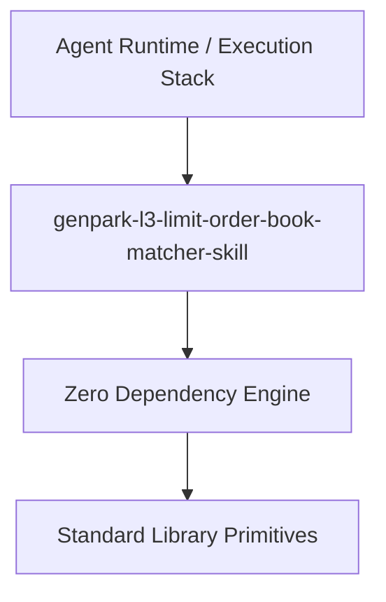

# genpark-l3-limit-order-book-matcher-skill

[](https://github.com/alphaparkinc/genpark-l3-limit-order-book-matcher-skill)
[](https://github.com/alphaparkinc/genpark-l3-limit-order-book-matcher-skill)
[](https://www.python.org/)

Ultra-low-latency Price-Time Priority Level-3 (L3) Limit Order Book (LOB) matching engine with continuous price queues and fills.



## Features
- **Strict 0 Pip Dependencies**: Built completely using the Python Standard Library.
- **Fast Execution & Verification**: Includes client wrapper, MCP server, and verified test suites.
- **Agentic AI Ready**: Exposes standard MCP tools for continuous LLM integration.

## Installation & Quickstart
```bash
git clone https://github.com/alphaparkinc/genpark-l3-limit-order-book-matcher-skill.git
cd genpark-l3-limit-order-book-matcher-skill
python example_usage.py
```
